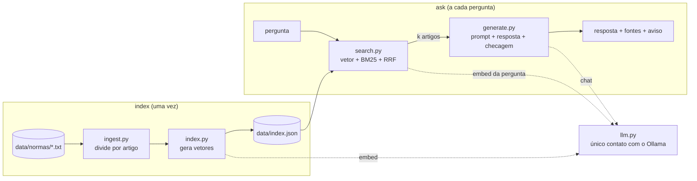
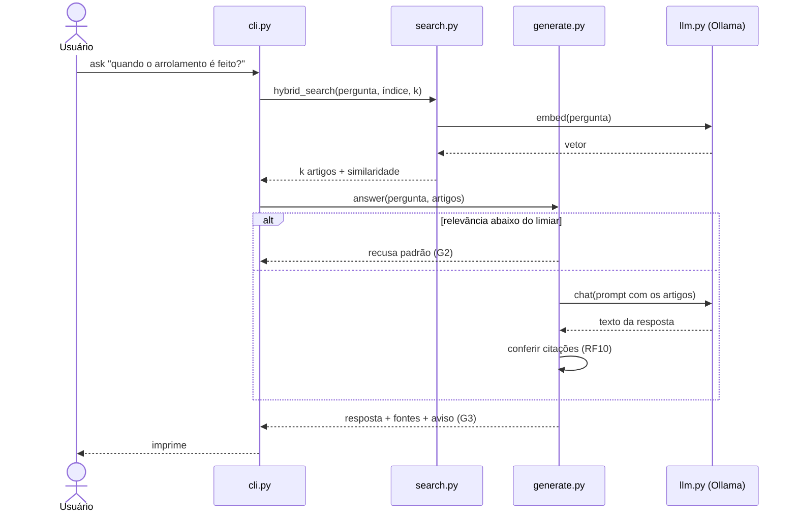

# Arquitetura — `rag-normas` v1.0

> Gerado pelo prompt [`PROMPTS/02-arquitetura/01-arquitetura-e-modulos.md`](../PROMPTS/02-arquitetura/01-arquitetura-e-modulos.md)
> e revisado pelo autor. Requisitos em [`requisitos.md`](requisitos.md).

## 1. Visão geral

O sistema tem duas operações separadas:

- **`index`** (feita uma vez, ou quando o corpus muda): lê as normas, divide em artigos, calcula o vetor de
  cada artigo e grava tudo em `data/index.json`.
- **`ask`** (a cada pergunta): carrega o índice, busca os artigos mais relevantes, pede ao modelo a resposta
  usando só esses artigos, confere as citações e imprime resposta + fontes + aviso.



## 2. Módulos

Layout plano: o pacote `rag_normas/` fica na raiz do repositório, então `python -m rag_normas` funciona sem
instalar nada.

| Módulo | Responsabilidade única | Atende |
|---|---|---|
| `config.py` | Ler configuração (modelo de chat, *k*, endereço do Ollama, limiar) de variáveis de ambiente, com padrões | RF08 |
| `llm.py` | Falar com o Ollama: `embed(texts)` e `chat(messages)`. **É o único módulo que importa `ollama`** | RNF01, RNF06 |
| `ingest.py` | Ler os `.txt` de `data/normas/` e devolver a lista de `Chunk` (um por artigo) | RF01, RF02 |
| `index.py` | Calcular os vetores dos chunks, salvar e carregar `data/index.json` | RF03 |
| `search.py` | Tokenizar, calcular BM25 e similaridade de cosseno, fundir os rankings por RRF | RF04 |
| `generate.py` | Montar o prompt, aplicar a recusa, chamar o chat, conferir citações, formatar a saída | RF05–RF07, RF10, G1–G3 |
| `cli.py` + `__main__.py` | Interpretar `index` e `ask` na linha de comando e ligar os módulos | RF03, RF04, RF08 |

Fora do pacote: `eval/` (perguntas e script de avaliação, RF09), `tests/` (pytest) e `PROMPTS/`.

### Estrutura do repositório

```
rag-normas/
├── rag_normas/       config.py · llm.py · ingest.py · index.py · search.py · generate.py · cli.py · __main__.py
├── tests/            testes unitários, sem Ollama
├── eval/             perguntas.json · avaliar.py · relatorios/
├── data/normas/      textos das normas + FONTES.md   (data/index.json é gerado e fica fora do git)
├── docs/             requisitos.md · arquitetura.md
├── PROMPTS/          um subdiretório por fase, um .md por prompt CO-STAR
├── README.md · LICENSE · requirements.txt · pytest.ini · .gitignore
```

## 3. Dados

**`Chunk`** (um artigo): `norma` (ex.: `IN RFB 2.091/2022`), `artigo` (ex.: `"64-A"`), `texto` (o artigo
completo, com parágrafos e incisos), `vetor` (lista de 1024 números, só depois de indexado).

**`data/index.json`:**

```json
{
  "modelo_embedding": "bge-m3",
  "criado_em": "2026-10-08T10:00:00",
  "chunks": [
    {"norma": "IN RFB 2.091/2022", "artigo": "2", "texto": "Art. 2º A Secretaria ...", "vetor": [0.01, -0.02]}
  ]
}
```

Guardar o nome do modelo de embedding no índice permite avisar o usuário se ele trocar o modelo e esquecer de
reindexar (vetores de modelos diferentes não são comparáveis).

## 4. Fluxo de `ask`



## 5. Estratégia de testes

O ponto central: **`search.py` e `generate.py` não importam o Ollama.** Eles recebem `embed` e `chat` como
funções por parâmetro. Em produção, o `cli.py` passa as funções reais de `llm.py`; nos testes, passamos
funções falsas (*mocks*) que devolvem respostas fixas.

| Camada | O que testa | Ollama? | Critérios |
|---|---|---|---|
| Unitária | divisão em artigos, BM25, cosseno, RRF, montagem do prompt, recusa, verificação de citação, formatação | Não | CA01, CA02, CA06, CA07 |
| Avaliação | perguntas reais com o artigo esperado; mede acerto, recusa, citações e tempo; compara 3b × 7b | Sim | CA03, CA04, CA05, CA08, CA09 |

## 6. Decisões de projeto

| # | Decisão | Alternativa descartada | Motivo |
|---|---|---|---|
| D1 | Um chunk por artigo | Janela fixa de N palavras | O artigo é a unidade que o usuário cita; a referência sai de graça |
| D2 | Busca em memória, índice em JSON | Banco vetorial (Chroma, FAISS) | Poucas dezenas de chunks; menos dependência (RNF06) |
| D3 | Python puro para cosseno e BM25 | NumPy | Com ~36 chunks não há ganho; uma dependência a menos e o cálculo fica legível |
| D4 | `llm.py` é o único módulo que importa `ollama` | Chamar o Ollama de vários módulos | Isola o ponto externo; viabiliza os mocks (RNF03) |
| D5 | Funções injetadas por parâmetro | Variável global ou *patch* nos testes | Mais simples de ler e de testar para quem está começando |
| D6 | Citação em formato fixo `[Fonte: <norma>, art. N]` | Citação livre no texto | Torna a verificação do RF10 confiável: só conferimos o que o modelo citou nesse formato |
| D7 | Layout plano (`rag_normas/` na raiz) | `src/rag_normas/` | `python -m rag_normas` sem instalar o pacote; instruções de uso mais curtas |
| D8 | BM25 recalculado a cada pergunta | Guardar estatísticas no índice | Custo desprezível com ~36 chunks; um formato de índice mais simples |

## 7. Decisões em aberto (resolver durante a implementação)

1. **Critério de recusa (RF07).** O RRF devolve posições, não uma nota absoluta de relevância. Proposta: recusar
   quando a **melhor similaridade de cosseno** ficar abaixo de um limiar **e** nenhum termo raro da pergunta
   aparecer nos artigos. O valor do limiar é calibrado na Fase 4 com perguntas dentro e fora do corpus.
2. **Escopo da verificação de citações (RF10).** Mínimo: o artigo citado existe no índice. Mais forte: o artigo
   citado está entre os *k* recuperados. Começar pelo mínimo e medir quantas respostas o mais forte reprovaria.
3. **Conflito Lei × IN sobre o valor de corte** (R$ 500 mil no art. 64, § 7º, da Lei; R$ 2 milhões no art. 2º,
   II, da IN). O Decreto nº 7.573/2011 explica a diferença, mas não está no corpus. Opções: incluir o decreto na
   v1.0 ou registrar como limitação conhecida e como caso do conjunto de avaliação (resposta esperada: citar a
   IN para o limite vigente).
